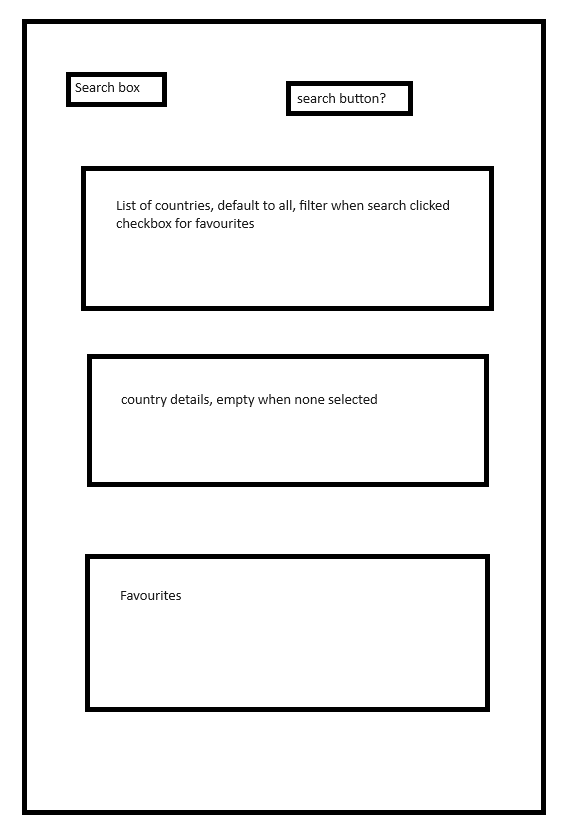

# countries-application
React Single Page Web Application that interacts with the REST Countries API
## Background
This is my first React project, I have some experience with Javascript, HTML and CSS
## Approach
- I'll be using ChatGPT and other online resources to work on the application and learn React
- I'm time boxing it to spend a maxmimum of 6 hours
- I'll see how far I get and if necessary after about 5.5 hours write a **Further Work** section
- Priorities are learning and functionality. Quality and polish will come later if time allows
## Wireframe
My first thought after reading the requirements is that it will look like this. Created in Paint for the sake of speed

